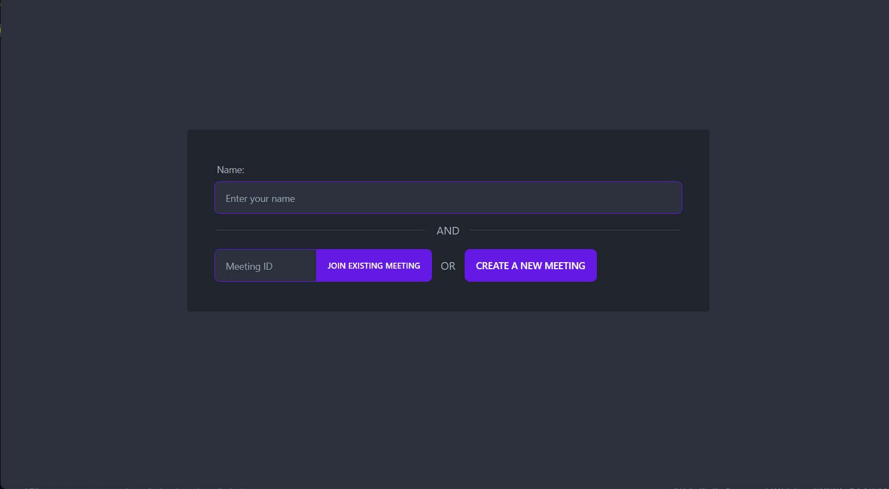

# Metered Python+React Video Calling Application

## Powered by [Metered Video SDK](https://www.metered.ca/)

## Overview



This application will give you a starting point on how to build a video chat application with React front-end and Python+Flask backend.

## Guide

The step by strep instructions on how this application is built can be found here: [WebRTC with Python: Building a Video Chat Application](https://www.metered.ca/blog/webrtc-with-python-building-a-video-chat-application/).

## Project Structure

The `backend` folder contains the python+flask code and the `react-frontend` folder contains the ReactJS front-end code.

## Setup Requirements

Before you can use this application, you would need a Metered Domain and Secret Key. To Obtain them do the following:

- Signup for a free account at https://dashboard.metered.ca/signup
- You will get the Metered Domain During Signup
- After Signup go to Developers page, from there you can get the Secret Key

## Setting up the Backend

Go to `backend` folder and created a `.env` file, in the `.env` file add the following contents

```env
export FLASK_APP=./flaskr
export METERED_SECRET_KEY="YOUR_METERED_SECRET_KEY"
export METERED_DOMAIN="<YOUR_METERED_DOMAIN>.metered.live"
```

```
python3 -m venv venv
. ./venv/bin/activate
pip install -r requirements.txt
```

To start the backend run

```
flask run
```

## Setting up the front-end

`cd` into the the `react-frontend` directory and run

```
npm install
npm run start
```

The front-end application will be available at http://localhost:3000/

The backend application will be running at http://localhost:5000

Instead of building the React Front-End yourself you can also use Metered Pre-Built UI to [Embed Video Chat ](https://www.metered.ca/embed-video-chat) in your application or website.

## Further Reading

Checkout https://docs.metered.ca to read more about the Metered Video API
